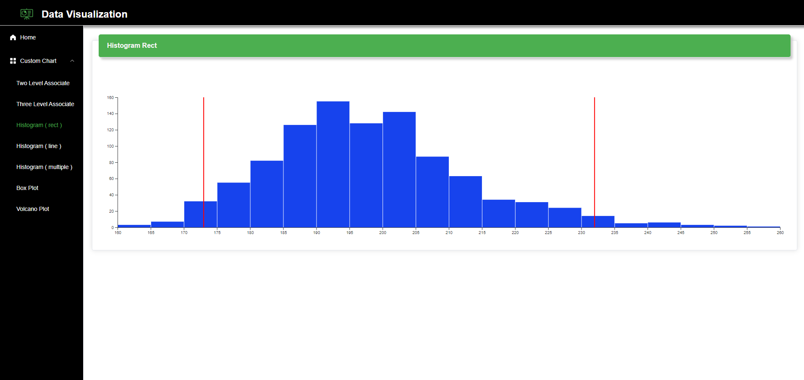
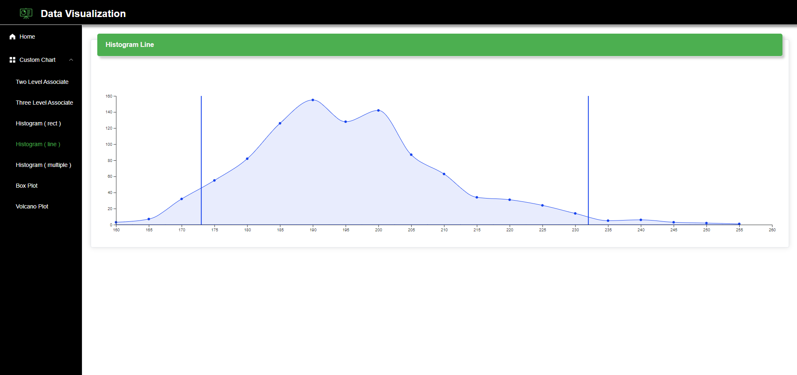
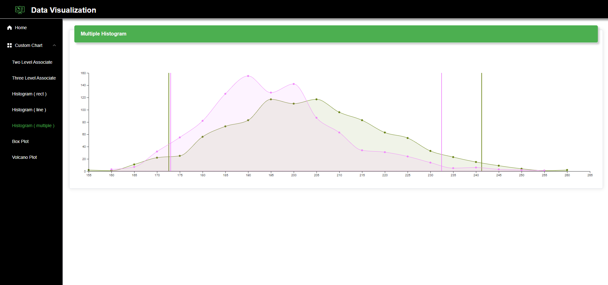
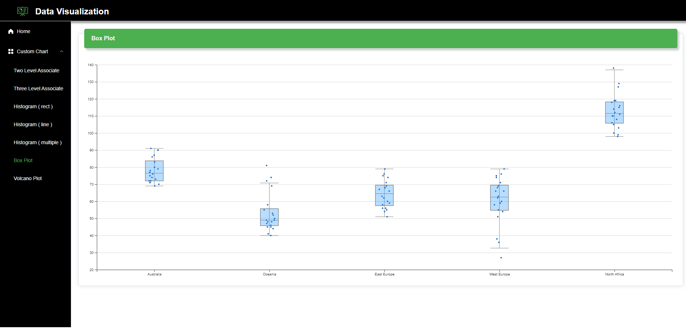
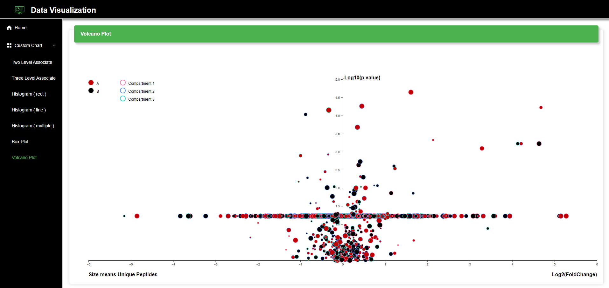

# Data visualization

#### 介绍
一个数据可视化项目，使用 d3.js 和 AntV 创建各种定制可视化图表。

#### 软件架构
软件架构说明
1. 前端框架：vue3.js
2. d3.js: https://d3js.org/
3. AntV: https://antv.antgroup.com/zh
4. UI组件库：element-plus


#### 安装教程

1. 拉取代码 

    ```bash
    # gitee
    git clone https://gitee.com/li-jiayin167/data-visualization.git
    #github
    git clone https://github.com/Jane167/Data-visualization.git
    ```

    

2. 在工程目录下` npm i` 安装依赖

3. `npm run serve `启动项目

#### 使用说明

安装项目依赖

```
npm install
```

编译运行项目

```
npm run serve
```

项目打包构建

```
npm run build
```

检查和修复文件

```
npm run lint
```

#### 项目演示

##### 二级联动图表

<video src="./src/assets/video/二级图表联动.mp4"></video>

##### 三级联动图表

<video src="./src/assets/video/三级联动图表.mp4"></video>

##### 直方图

用矩形表示的直方图，带有置信区间的矩形直方图



##### 线性直方图（面积图）

带有置信区间的线性直方图，你也可以理解为是面积图。



##### 多个线性直方图（面积图）

多个带有置信区间的线性直方图 / 面积图



##### 箱线图（Box Plot）



##### 火山图（Volcano Plot）



#### 参与贡献

1. Fork 本仓库
2. Star 本仓库
3. 提交 issue
4. 新建 Pull Request
